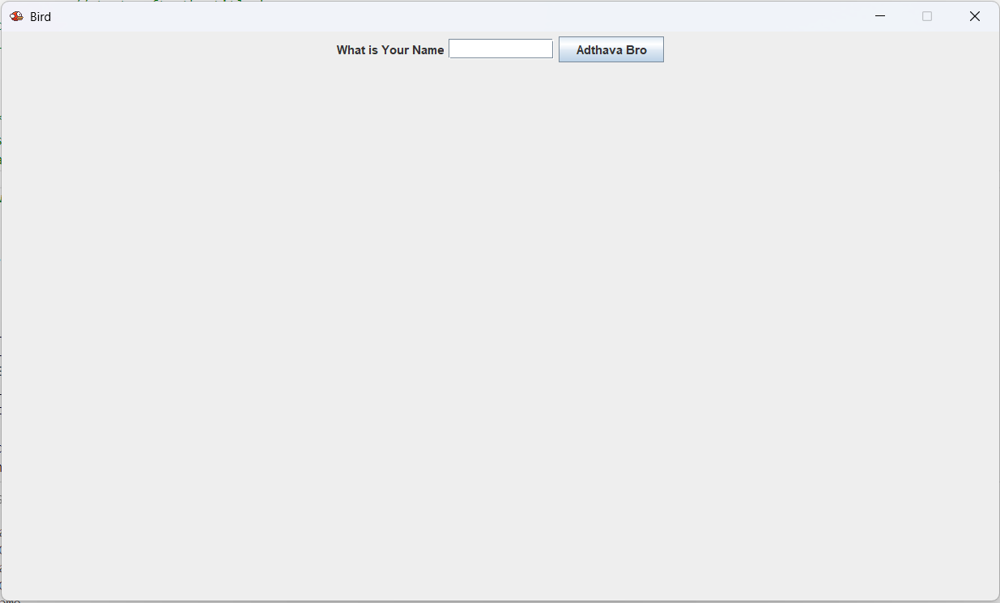
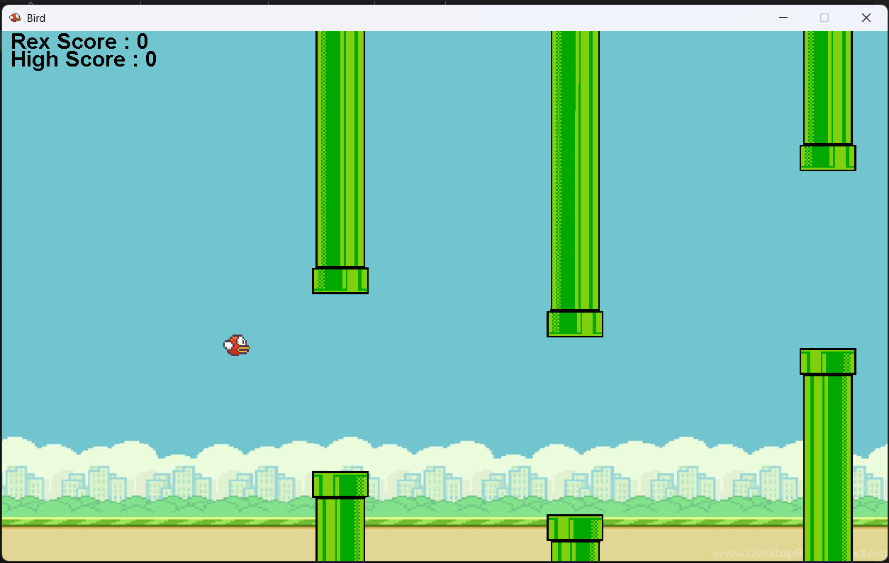
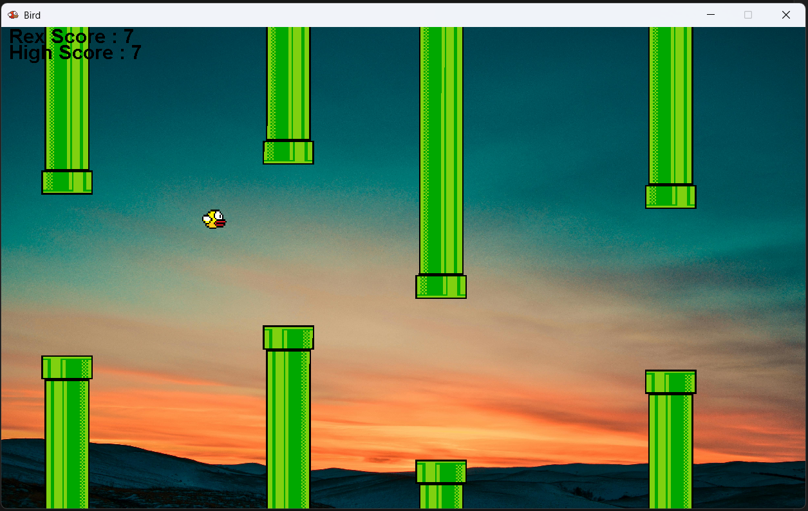
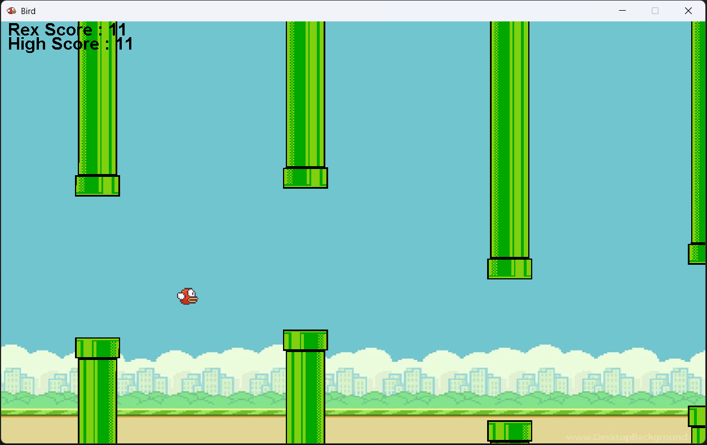
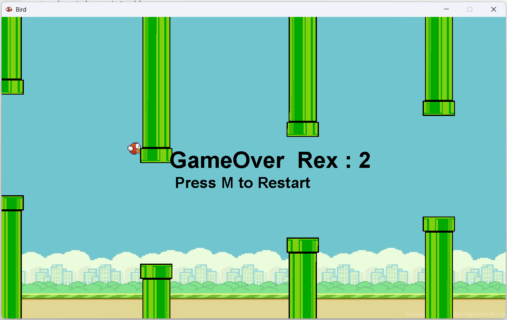

# Flappy Bird Clone

This is a Java-based Flappy Bird clone game. The game features a bird that needs to navigate through pipes without colliding with them. The score increases as the bird successfully passes through the pipes.

## Features

- Simple and engaging gameplay
- Score tracking
- High score tracking
- Background and bird change based on the score

## Requirements

- Java Development Kit (JDK) 8 or higher

## How to Run

1. Clone the repository:
    ```bash
    git clone https://github.com/SaiNaniSmartRex/Flappt-Bird-Clone.git
    cd Flappt-Bird-Clone
    ```

2. Compile and run the game:
    ```bash
    javac Game.java
    java Game
    ```

## Gameplay Instructions

- Press the **Space** key to make the bird jump.
- Avoid hitting the pipes and the ground.
- Press the **M** key to restart the game after a game over.

## Code Overview

The main classes in this project include:

- **Game**: Handles the main game logic and UI.
- **Bird**: Manages the bird's behavior, movement, and collision detection.
- **Pipe**: Represents the pipes that the bird must avoid.

## Screenshots








## Contributing

Feel free to fork this repository and submit pull requests. Any contributions are welcome!
